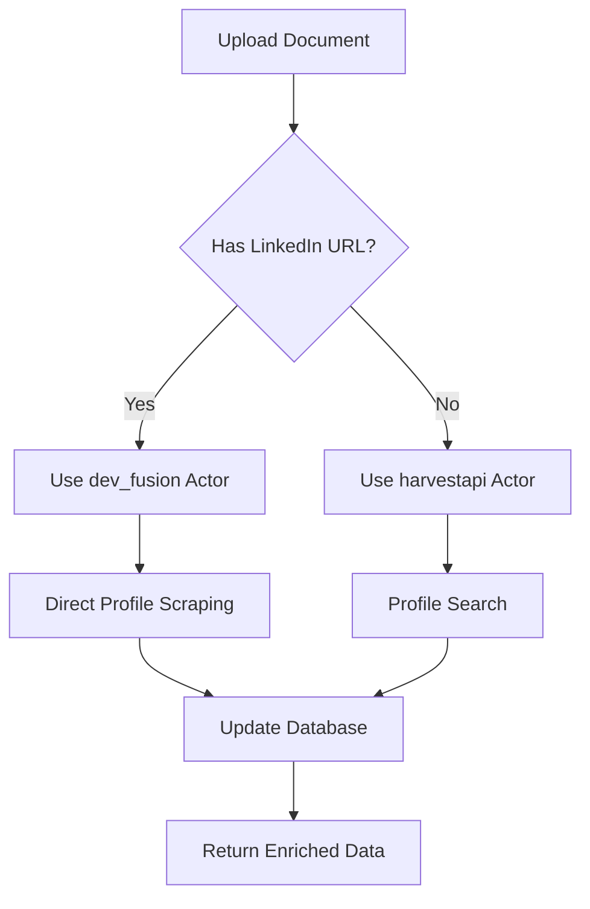

# LinkedIn Actors Integration

This document describes the enhanced LinkedIn integration that intelligently chooses between two Apify actors based on the available data.

## Overview

The Talent Scout application now uses a **dual-actor approach** for LinkedIn data extraction:

1. **`dev_fusion/Linkedin-Profile-Scraper`** - Used when LinkedIn URLs are available
2. **`harvestapi/linkedin-profile-search`** - Used as fallback when no LinkedIn URLs are available

## Actor Selection Logic

### When to Use dev_fusion Actor

The system automatically uses the `dev_fusion/Linkedin-Profile-Scraper` actor when:

- A candidate's document contains a LinkedIn profile URL
- The `enrichProfile` method is called with a LinkedIn URL
- The `searchProfilesWithApify` method finds candidates with LinkedIn URLs

**Benefits:**
- Direct profile scraping from LinkedIn URLs
- More accurate and comprehensive data
- Faster processing (no search required)
- Better data quality for known profiles

### When to Use harvestapi Actor

The system falls back to the `harvestapi/linkedin-profile-search` actor when:

- No LinkedIn URLs are available in candidate data
- The dev_fusion actor fails or returns no results
- General profile search is needed

**Benefits:**
- Can find profiles without known URLs
- Broader search capabilities
- Fallback option for edge cases

## Implementation Details

### Actor IDs

```typescript
// dev_fusion actor
const DEV_FUSION_ACTOR_ID = "2SyF0bVxmgGr8IVCZ";

// harvestapi actor  
const HARVESTAPI_ACTOR_ID = "harvestapi/linkedin-profile-search";
```

### Data Flow



### Database Updates

When LinkedIn data is fetched, the system automatically updates:

1. **Candidate Table** - Updates with LinkedIn profile information
2. **Resume Data Table** - Enriches with LinkedIn data
3. **Activity Log** - Tracks all LinkedIn updates

## Usage Examples

### Profile Search with LinkedIn URL Available

```typescript
const linkedInService = new LinkedInService();

// When candidates have LinkedIn URLs
const candidates = [
  {
    id: 'candidate-1',
    name: 'John Doe',
    linkedinUrl: 'https://www.linkedin.com/in/johndoe'
  }
];

// This will use dev_fusion actor
const result = await linkedInService.searchProfilesWithApify(
  'John Doe',
  'Software Engineer',
  'Tech Corp',
  'San Francisco',
  20,
  candidates
);
```

### Profile Enrichment with LinkedIn URL

```typescript
// This will use dev_fusion actor for direct scraping
const enrichedProfile = await linkedInService.enrichProfile(
  'https://www.linkedin.com/in/johndoe',
  'John Doe',
  'Tech Corp',
  'Software Engineer',
  'San Francisco'
);
```

### Fallback to harvestapi

```typescript
// When no LinkedIn URL is available
const candidates = [
  {
    id: 'candidate-2',
    name: 'Jane Smith',
    // No linkedinUrl field
  }
];

// This will use harvestapi actor
const result = await linkedInService.searchProfilesWithApify(
  'Jane Smith',
  'Product Manager',
  'Startup Inc',
  'New York',
  20,
  candidates
);
```

## Configuration

### Environment Variables

```bash
# Required for both actors
APIFY_API_TOKEN=your_apify_api_token_here
```

### Actor Configuration

#### dev_fusion Actor
- **Input**: `{ profileUrls: [linkedinUrl] }`
- **Output**: Complete LinkedIn profile data
- **Rate Limits**: Depends on your Apify subscription

#### harvestapi Actor
- **Input**: Search parameters (name, title, company, location)
- **Output**: Search results with profile data
- **Rate Limits**: Depends on your Apify subscription

## Data Storage

### Results Directory Structure

```
project-root/
├── devfusion-results/          # dev_fusion actor results
│   ├── devfusion_johndoe_2025-01-20T10-30-00-000Z.json
│   └── devfusion_janesmith_2025-01-20T11-15-00-000Z.json
├── harvestapi-results/         # harvestapi actor results
│   ├── harvestapi_John_Doe_Software_Engineer_Tech_Corp_San_Francisco_2025-01-20T10-30-00-000Z.json
│   └── summaries/
└── ...
```

### Database Schema Updates

The system automatically maps LinkedIn data to existing database fields:

```typescript
// Candidate table updates
{
  name: linkedInData.name,
  title: linkedInData.title || linkedInData.headline,
  currentEmployer: linkedInData.company || linkedInData.currentCompany,
  location: linkedInData.location,
  skills: linkedInData.skills,
  openToWork: linkedInData.openToWork,
  linkedinUrl: linkedInData.profileUrl,
  linkedinLastActive: new Date(),
  source: 'dev_fusion' | 'harvestapi'
}

// Resume data table updates
{
  name: linkedInData.name,
  title: linkedInData.title,
  location: linkedInData.location,
  summary: linkedInData.summary || linkedInData.about,
  experience: linkedInData.experience,
  education: linkedInData.education,
  skills: linkedInData.skills,
  certifications: linkedInData.certifications
}
```

## Error Handling

### Fallback Strategy

1. **Primary**: Try dev_fusion actor if LinkedIn URL available
2. **Fallback**: Use harvestapi actor if dev_fusion fails
3. **Graceful Degradation**: Create basic profile if both fail

### Error Types

```typescript
// Apify API errors
if (apifyError.statusCode === 403) {
  throw new Error('Apify API access denied. Check subscription and credentials.');
} else if (apifyError.statusCode === 429) {
  throw new Error('Apify API rate limit exceeded. Try again later.');
} else if (apifyError.statusCode === 500) {
  throw new Error('Apify service temporarily unavailable. Try again later.');
}
```

## Testing

Run the test script to verify both actors work correctly:

```bash
node test-linkedin-actors.js
```

This will test:
- Profile search with LinkedIn URLs (dev_fusion)
- Profile search without LinkedIn URLs (harvestapi)
- Profile enrichment with LinkedIn URLs (dev_fusion)
- Profile enrichment without LinkedIn URLs (harvestapi)

## Benefits

1. **Intelligent Actor Selection** - Automatically chooses the best actor for the data
2. **Improved Data Quality** - Direct scraping when URLs are available
3. **Fallback Support** - Always has a backup option
4. **Automatic Database Updates** - Fetched data is immediately stored
5. **Comprehensive Logging** - Tracks which actor was used and when
6. **Cost Optimization** - Uses more efficient direct scraping when possible

## Future Enhancements

- **Actor Performance Metrics** - Track success rates and response times
- **Dynamic Actor Selection** - Choose based on historical performance
- **Batch Processing** - Process multiple LinkedIn URLs simultaneously
- **Caching Layer** - Store results to avoid repeated API calls
- **Rate Limit Management** - Intelligent queuing and retry logic

